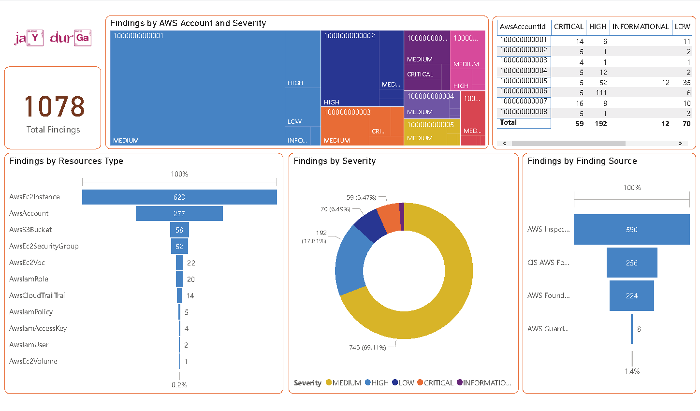
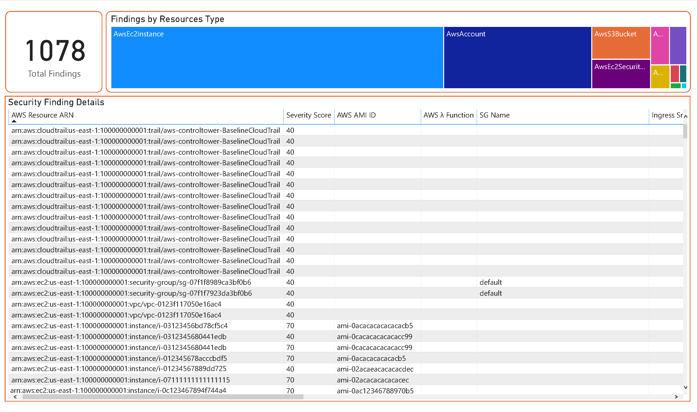
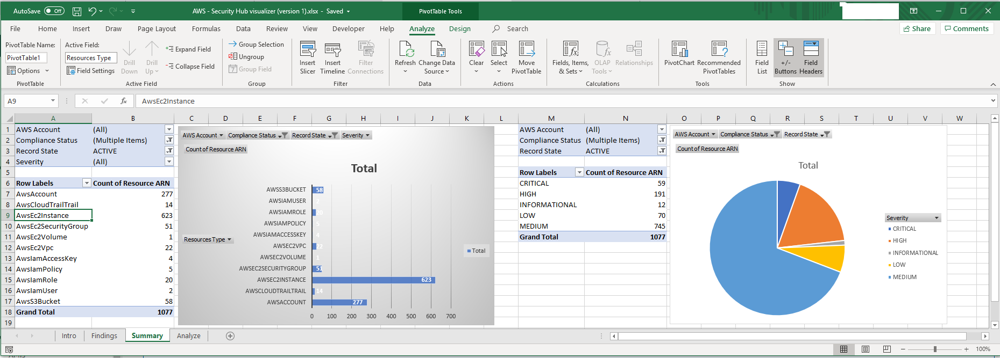
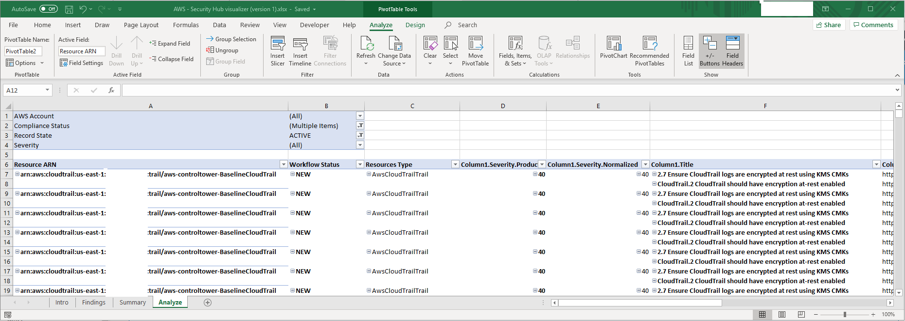
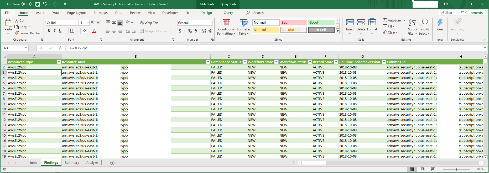

# aws-securityhub-data-visualizer
Visualizing Security Hub findings using the Power BI and/or MS Excel tool. 

### Notes
The template has been configured with the location of json file as c:\temp\SecurityHub-Findings.json This can be easily changed by navigating to Data tab and modifying the query.

Currently, the template has been tested only with Security Hub findings from Security Hub Security Standards, GuardDuty and AWS Inspector. 

### Security Hub Findings
Generate latest Security Hub findings using below command.

```bash
aws securityhub get-findings --profile [AWS_PROFILE]  > c:\temp\SecurityHub-Findings.json
```


### Security Hub Findings
Launch the Power BI template, click on refresh to load the latest JSON findings. 
For excel template, go to Data tab & Refresh All for all the tabs starting with Findings tab first.

Power BI sample report



Excel sample report



